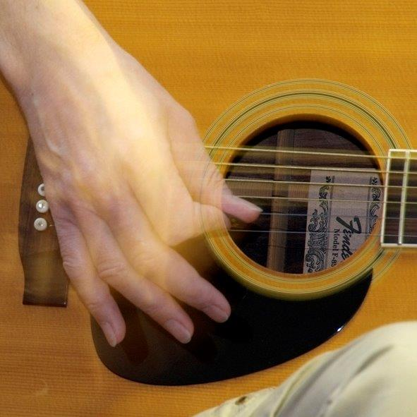

# Gitarren- und Bassunterricht mit Knowhow und Spaß

## Peter Karliczek

Binnenweide 13  
27449 Kutenholz  
Telefon: 04762 2386  
Mobil: 0170 58 59 451

Musikmachen trainiert das Gehirn, hat sich bei Untersuchungen gezeigt.

Die US-Psychologin Francis Rauscher sagt dazu: „Frühe Musikerziehung [...] fördert eine Art von Intelligenz, die für besonders wissenschaftliches und mathematisches Denken notwendig ist.“

Durch aktive Musikausübung werden grundsätzliche menschliche Bedürfnisse wie Zufriedenheit, Entspannung, Freude, psychishe und physische Harmonie in uns und beim Austausch mit anderen gefördert.

